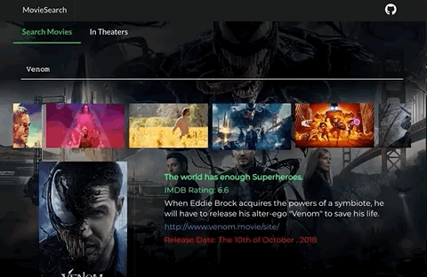

# movieSearch

Live Demo:
[MovieSearch](https://inphoenix.github.io/movieSearch100/)

    # inMovieSearch

Fetch Examples using React Select 2.0 and RxJs 6.0

## The stack
- [x] React
- [x] [React Select 2.0](https://github.com/JedWatson/react-select)
- [x] [Redux Observable 1.0](https://redux-observable.js.org/#) 
- [x] [RxJs 6](https://github.com/reactivex/rxjs)
- [x] [TMDB](www.themoviedb.org)
